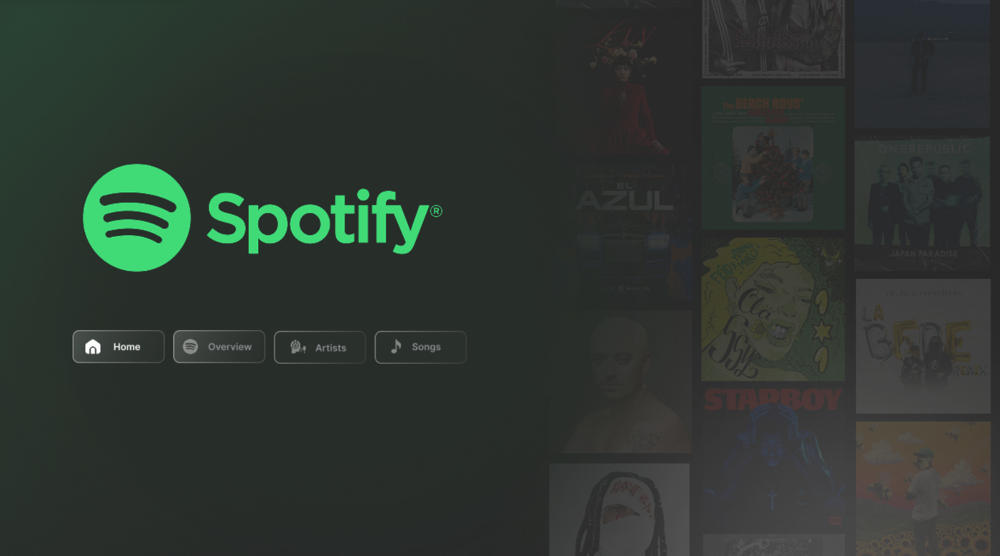
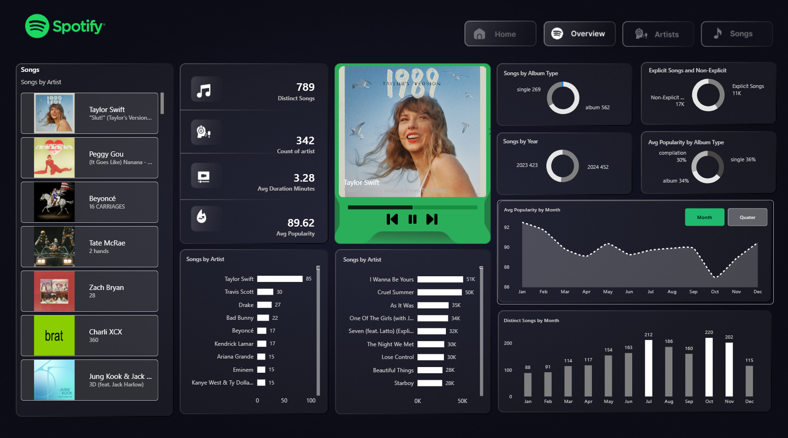
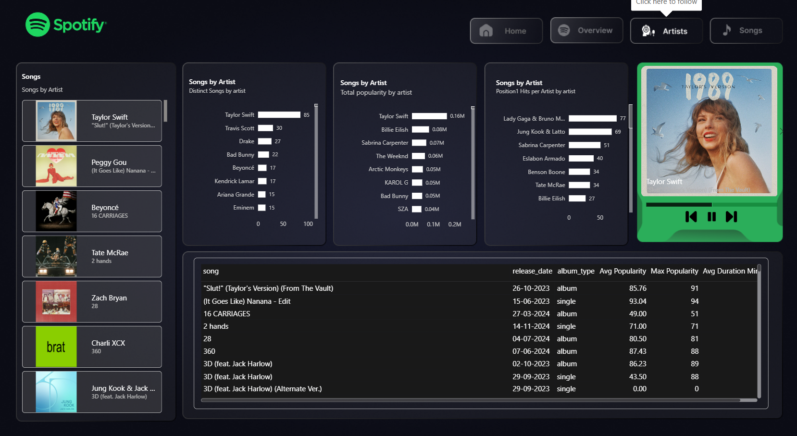
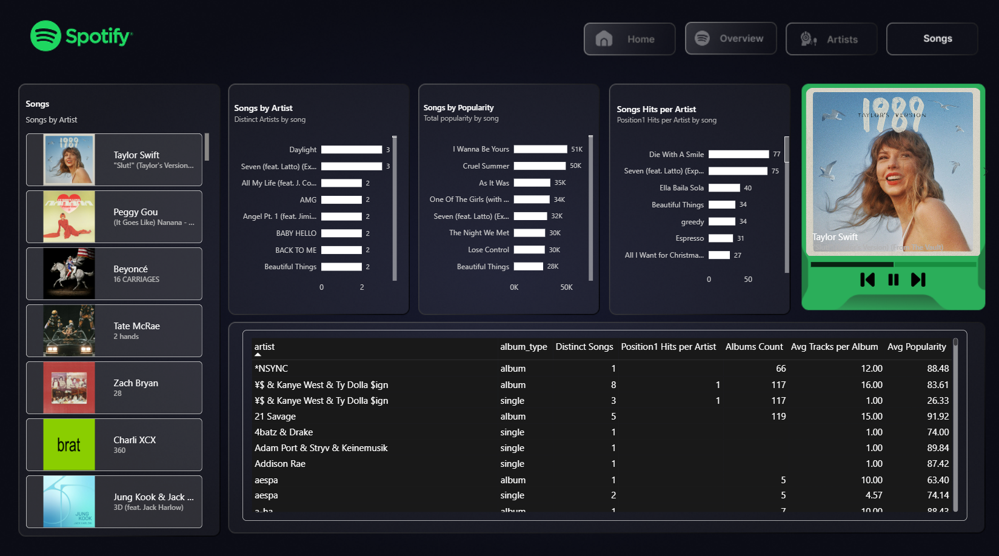

# 🎵 Spotify Analytics Dashboard

An interactive Spotify Analytics Dashboard built using **Power BI** to analyze songs, artists, albums, and popularity through dynamic visualizations and user-friendly navigation.

---

## 📌 Project Overview

This dashboard recreates my earlier Spotify Analytics project built in Excel using Power BI, with a focus on creating a more interactive and dynamic reporting experience.

### Features

- Interactive multi-page navigation
- Dynamic artist selection with image updates
- KPI cards and performance metrics
- Interactive charts and slicers
- Power Query data transformation
- DAX measures for calculated insights

---

## 🛠️ Tech Stack

- Power BI
- Power Query
- DAX
- Data Modeling
- Data Visualization

---

## 📷 Dashboard Preview

### Home

---

### Overview

---

### Artists

---

### Songs

---

## 🎥 Dashboard Demo

Download and watch the dashboard demo here:

[▶️ Spotify Dashboard Demo](assets/5-dashboard-demo.mp4)

---

## 📁 Repository Contents

- Spotify_Dashboard.pbix
- Top-50-world.csv

---

## 🚀 Skills Demonstrated

- Dashboard Design
- Interactive Reporting
- Data Cleaning
- Data Transformation
- Power Query
- DAX
- Data Modeling
- Business Intelligence

---

### Created by **Dakshita Bahal**
